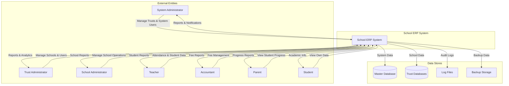
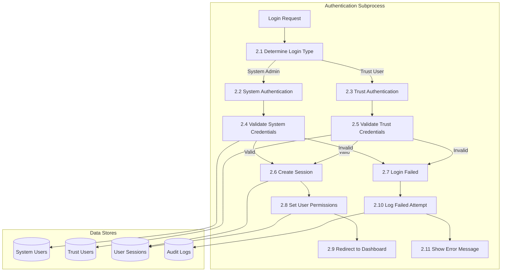
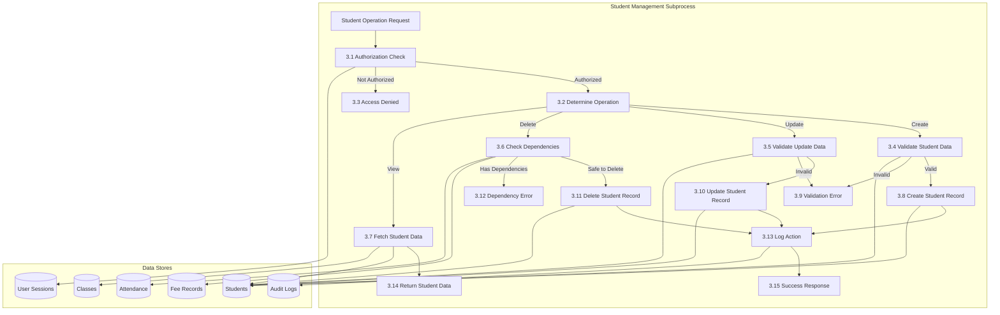
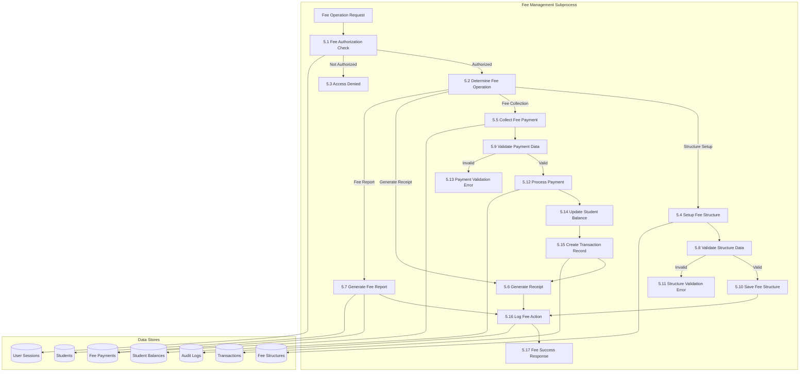
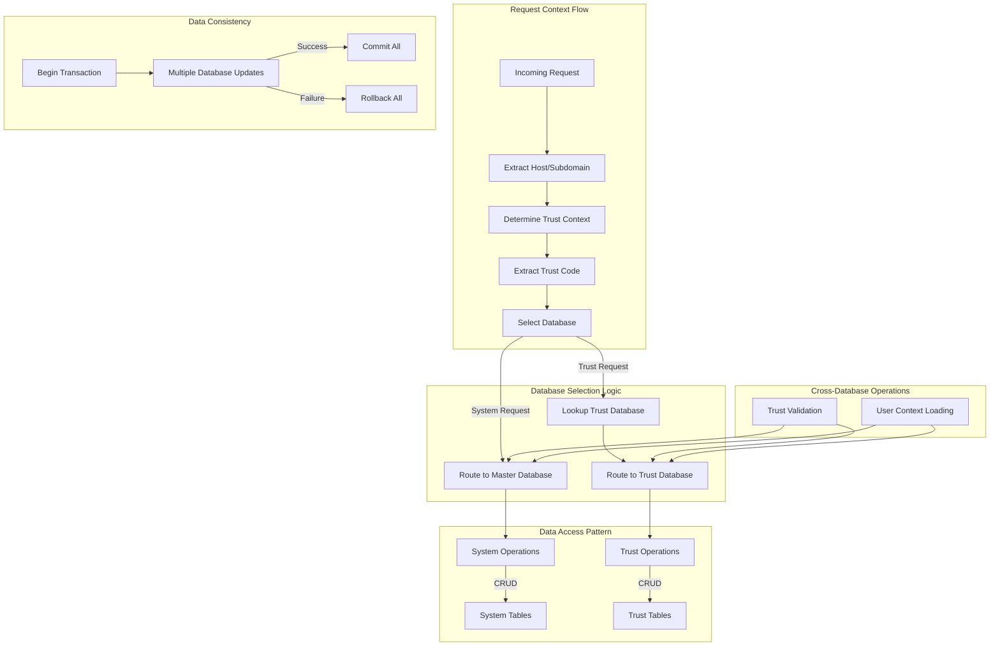
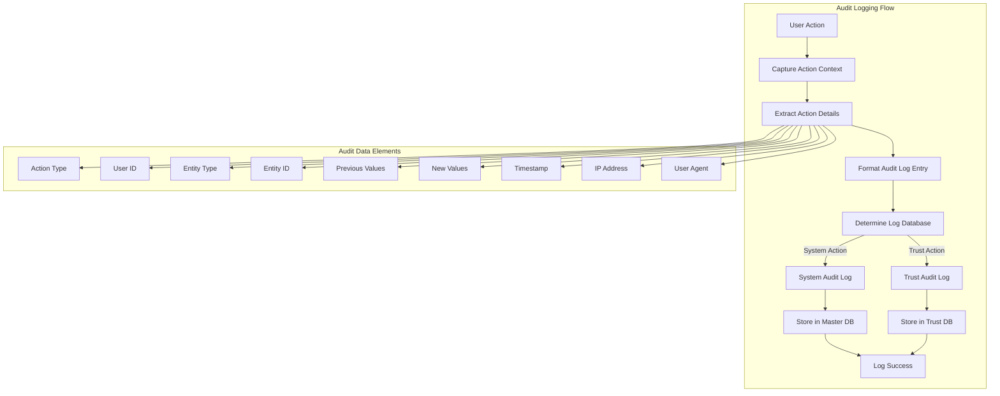
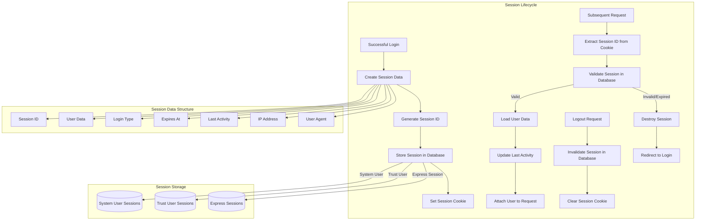

# School ERP Data Flow Diagram

## Level 0 - Context Diagram

## Level 1 - System Breakdown

```mermaid
graph TB
    subgraph "Authentication & Authorization"
        AUTH_PROCESS[1.0 Authentication Process]
        SESSION_MGT[1.1 Session Management]
        RBAC_CHECK[1.2 Role-Based Access Control]
    end
    
    subgraph "User Management"
        USER_MGT[2.0 User Management]
        PROFILE_MGT[2.1 Profile Management]
        ROLE_ASSIGNMENT[2.2 Role Assignment]
    end
    
    subgraph "Academic Management"
        STUDENT_MGT[3.0 Student Management]
        CLASS_MGT[3.1 Class Management]
        ACADEMIC_YEAR[3.2 Academic Year Management]
    end
    
    subgraph "Attendance System"
        ATTENDANCE_ENTRY[4.0 Attendance Entry]
        ATTENDANCE_REPORT[4.1 Attendance Reporting]
    end
    
    subgraph "Fee Management"
        FEE_STRUCTURE[5.0 Fee Structure Management]
        FEE_COLLECTION[5.1 Fee Collection]
        FEE_REPORTING[5.2 Fee Reporting]
    end
    
    subgraph "Reporting & Analytics"
        REPORT_GEN[6.0 Report Generation]
        ANALYTICS[6.1 Analytics Engine]
        DASHBOARD[6.2 Dashboard Services]
    end
    
    subgraph "Data Stores"
        USERS_DB[(Users Database)]
        STUDENTS_DB[(Students Database)]
        ACADEMIC_DB[(Academic Database)]
        FEES_DB[(Fees Database)]
        LOGS_DB[(Audit Logs)]
        SESSIONS_DB[(Sessions Database)]
    end
    
    %% Authentication flows
    AUTH_PROCESS --> USERS_DB
    SESSION_MGT --> SESSIONS_DB
    RBAC_CHECK --> USERS_DB
    
    %% User management flows
    USER_MGT --> USERS_DB
    PROFILE_MGT --> USERS_DB
    ROLE_ASSIGNMENT --> USERS_DB
    
    %% Academic flows
    STUDENT_MGT --> STUDENTS_DB
    CLASS_MGT --> ACADEMIC_DB
    ACADEMIC_YEAR --> ACADEMIC_DB
    
    %% Attendance flows
    ATTENDANCE_ENTRY --> ACADEMIC_DB
    ATTENDANCE_REPORT --> ACADEMIC_DB
    
    %% Fee flows
    FEE_STRUCTURE --> FEES_DB
    FEE_COLLECTION --> FEES_DB
    FEE_REPORTING --> FEES_DB
    
    %% Reporting flows
    REPORT_GEN --> STUDENTS_DB
    REPORT_GEN --> ACADEMIC_DB
    REPORT_GEN --> FEES_DB
    ANALYTICS --> STUDENTS_DB
    ANALYTICS --> ACADEMIC_DB
    ANALYTICS --> FEES_DB
    DASHBOARD --> USERS_DB
    DASHBOARD --> STUDENTS_DB
    DASHBOARD --> ACADEMIC_DB
    DASHBOARD --> FEES_DB
    
    %% Audit logging
    AUTH_PROCESS --> LOGS_DB
    USER_MGT --> LOGS_DB
    STUDENT_MGT --> LOGS_DB
    FEE_COLLECTION --> LOGS_DB
```

## Level 2 - Authentication Process Detailed

## Level 2 - Student Management Process

## Level 2 - Fee Management Process

## Data Flow for Multi-Tenant Architecture

## Audit Trail Data Flow

## Session Data Flow

