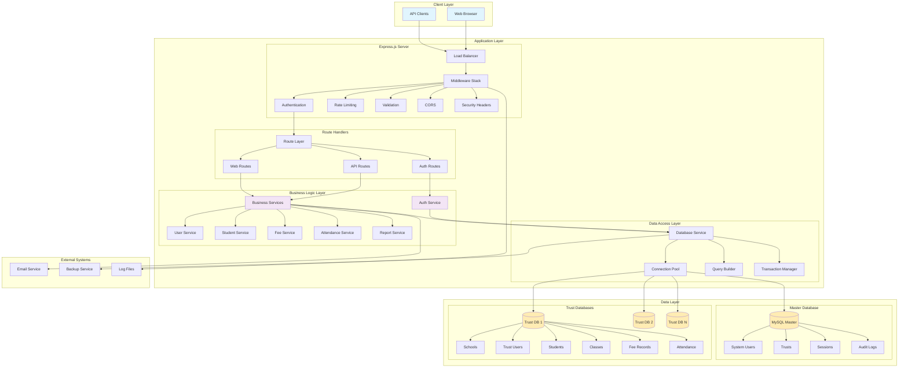
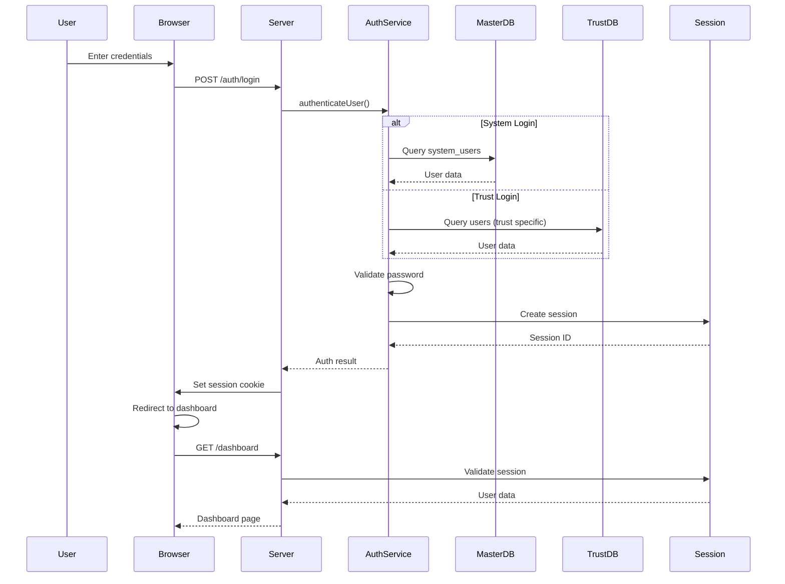
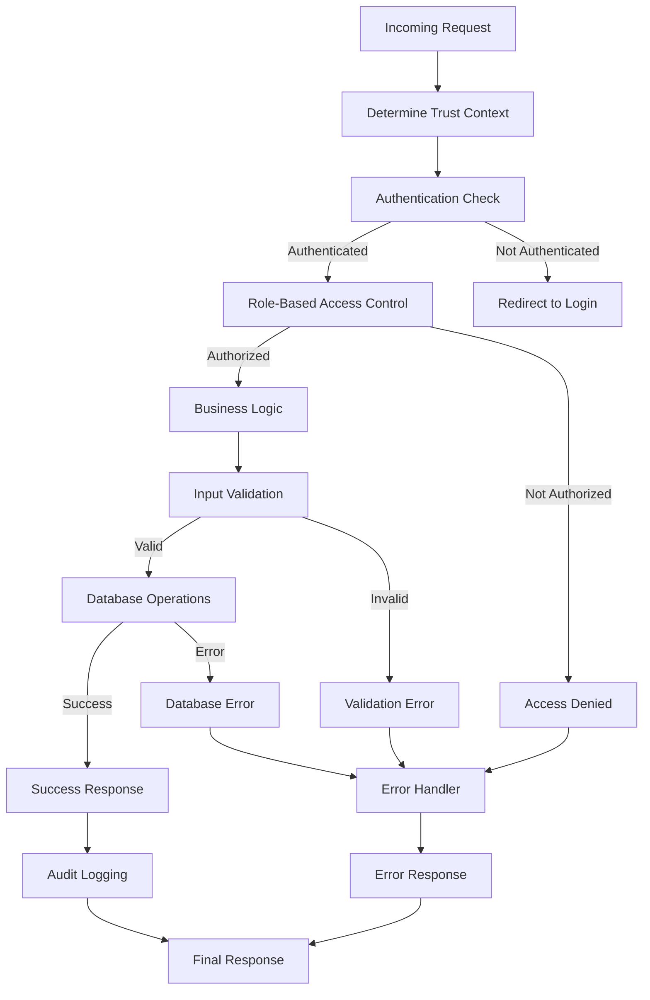
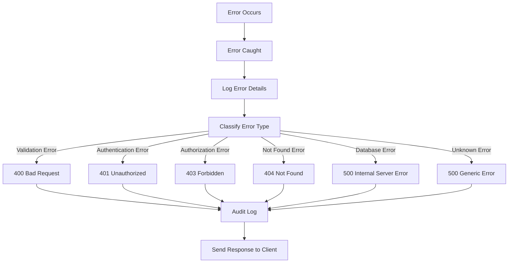
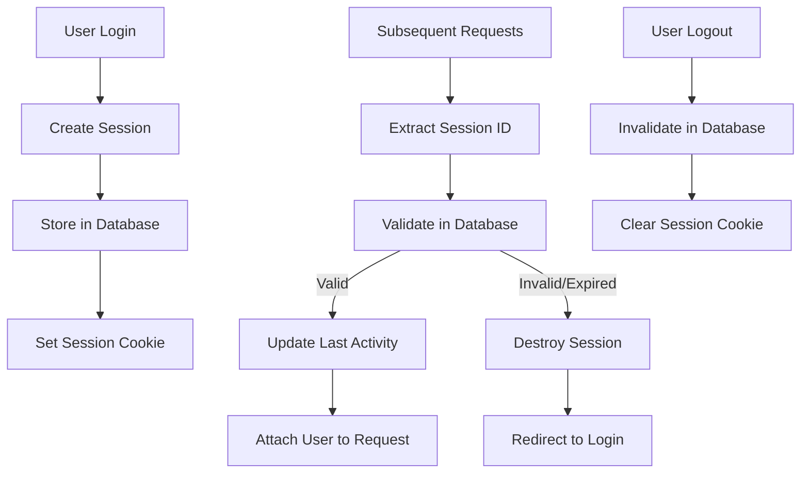

# School ERP System Flow Diagram

## High-Level Architecture

## Authentication Flow

## Request Processing Flow

## Multi-Tenant Database Architecture

```mermaid
graph TB
    subgraph "Application Server"
        APP[Express.js Application]
        DB_SERVICE[Database Service]
        APP --> DB_SERVICE
    end
    
    subgraph "Database Layer"
        subgraph "Master Database (school_erp)"
            SYSTEM_USERS[system_users]
            TRUSTS[trusts]
            SYSTEM_SESSIONS[system_user_sessions]
            SYSTEM_AUDIT[system_audit_logs]
            EXPRESS_SESSIONS[sessions]
        end
        
        subgraph "Trust Database 1 (school_erp_trust_demo)"
            SCHOOLS1[schools]
            USERS1[users]
            STUDENTS1[students]
            CLASSES1[classes]
            FEES1[fee_records]
            ATTENDANCE1[attendance]
            SESSIONS1[user_sessions]
        end
        
        subgraph "Trust Database N (school_erp_trust_N)"
            SCHOOLSN[schools]
            USERSN[users]
            STUDENTSN[students]
            CLASSESN[classes]
            FEESN[fee_records]
            ATTENDANCEN[attendance]
            SESSIONSN[user_sessions]
        end
    end
    
    DB_SERVICE --> |System Operations| SYSTEM_USERS
    DB_SERVICE --> |Trust Management| TRUSTS
    DB_SERVICE --> |Trust 1 Operations| SCHOOLS1
    DB_SERVICE --> |Trust N Operations| SCHOOLSN
    
    style SYSTEM_USERS fill:#ffcdd2
    style TRUSTS fill:#ffcdd2
    style SCHOOLS1 fill:#c8e6c9
    style SCHOOLSN fill:#c8e6c9
```

## Error Handling Flow

## Session Management Flow

